# Application Insights - Hands-on Lab Script - part 1

Mark Harrison : checked & updated 31 March 2020 - original 6 Aug 2018


- [Part 1 - Create AppInsights instance](appinsights-1.md) ... this document
- [Part 2 - Develop and deploy AppInsights enabled webapp](appinsights-2.md)
- [Part 3 - Get insights on application](appinsights-3.md)
- [Part 4 - Advanced Analytics](appinsights-4.md)  
- [Part 5 - Availability Monitoring](appinsights-5.md)
- [Part 6 - Usage Behaviour Analysis](appinsights-6.md)

## Create AppInsights instance

### Overview

Application Insights is an extensible Application Performance Management (APM) service for web developers on multiple platforms. Use it to monitor your live web application. It will automatically detect performance anomalies. It includes powerful analytics tools to help  diagnose issues and to understand what users actually do with an app. It's designed to help continuously improve performance and usability.

### Login

If neccessary - login and (if multiple subscriptions) select required subscription:

```text
az login
$subscriptionid = "*replace*"
az account set -s $subscriptionid
```

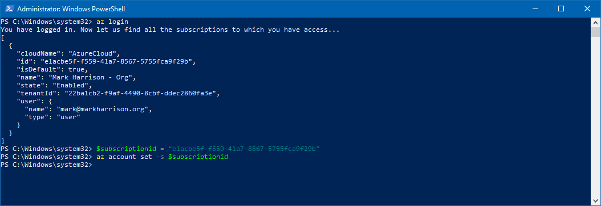

### Create Resource Group

All Azure resources must reside with an Azure resource group.

- Invoke the following:
  - Amend the resource group name to that required - and in the subsequent instructions ... saves typing it on overy command
  - Amend the location to that require

```text

$location = "northeurope"
az group create --name App-rg --location $location
az configure --defaults group=App-rg

```

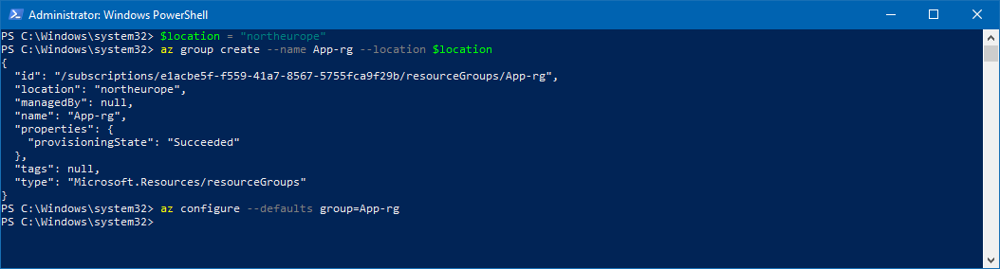

### Create AppInsights resource

- Invoke the following

```text
$appInsightsName = "markharrisonappins"
az resource create `
  -n $appInsightsName `
  --resource-type "Microsoft.Insights/components" `
  --properties '{\"Application_Type\":\"web\"}'
```

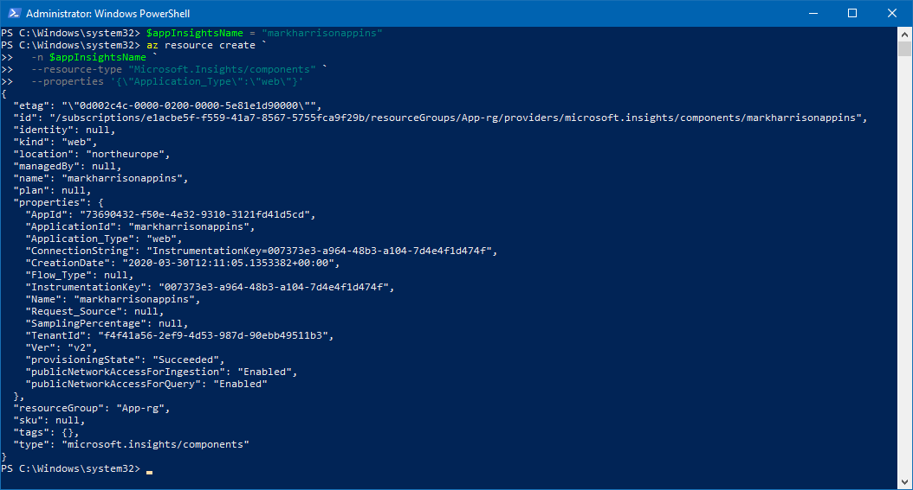

Make a note of the Instrumentation Key in the output jsom - will need it in the next section

### Create WebApp resource

- Invoke the following
  - Amend the WebApp name and plan to that required.

```text
$webappname = "MarkHarrisonApp"
$planname = "MarkHarrisonPlan"

az appservice plan create --name $planname  --sku F1
az webapp create --name $webappname  --plan $planname
```

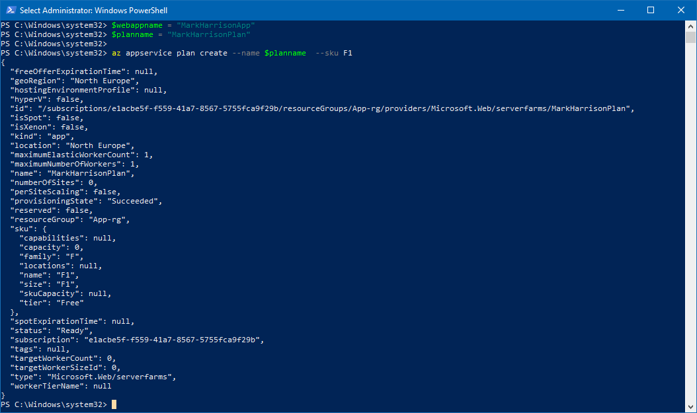

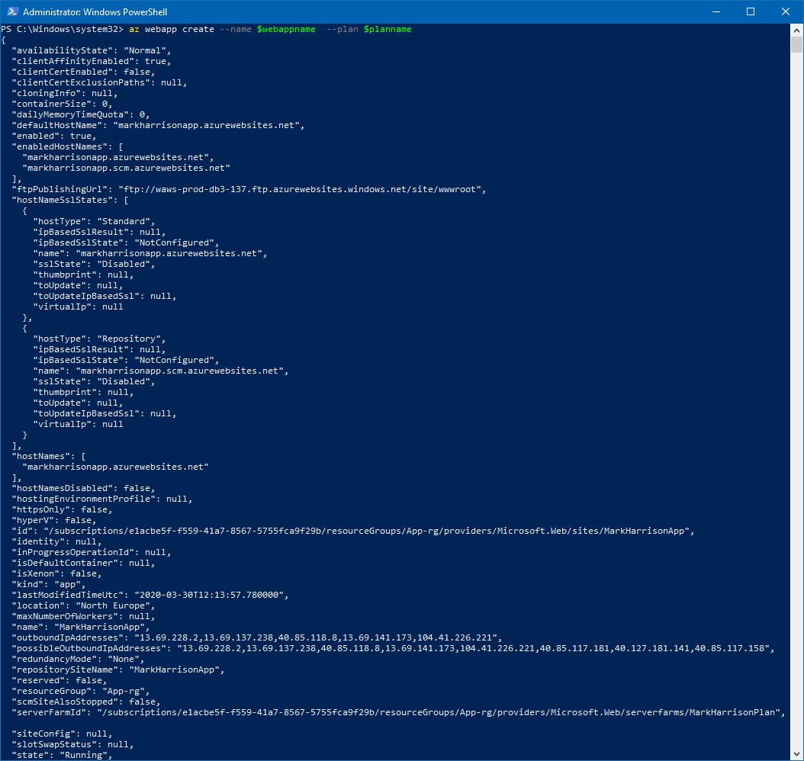

```text
$key = "*replace*"
az webapp config appsettings set -n $webappname --settings "APPINSIGHTS_INSTRUMENTATIONKEY = $key"
```

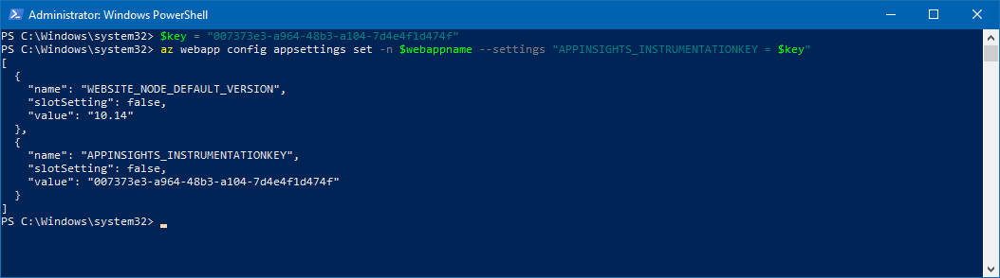

### AppInsights Blade

- Go to the WebApp in the Azure Management Portal

- Check the Resource Group for the Plan, WebApp and App Inisghts instance

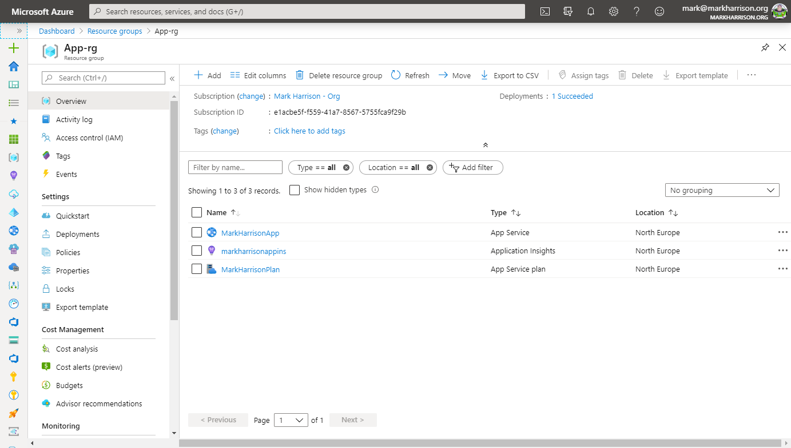

- Check the Web App... and goto App Insights link

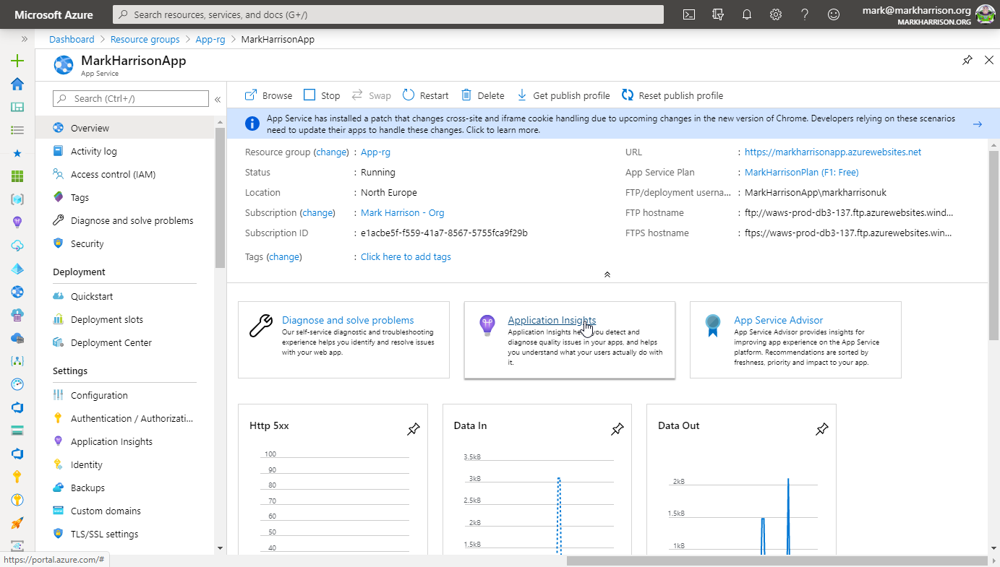

- Notice that the WebApp is linked to an App Insights instance

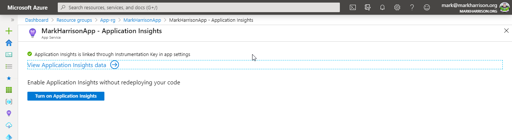

- Click on [View Application Insights data]

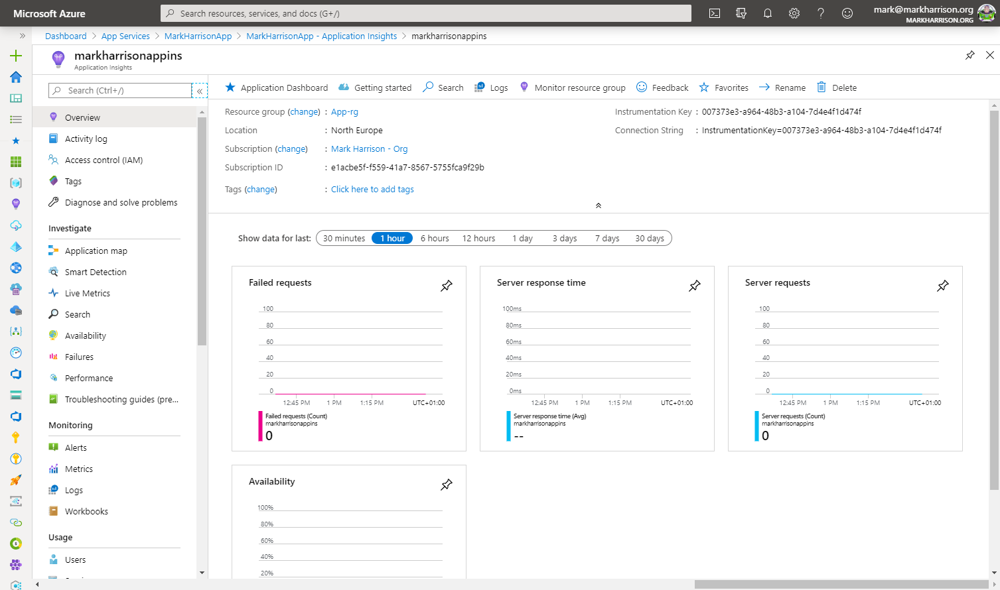

- Click on the [Application Dashboard] menu link

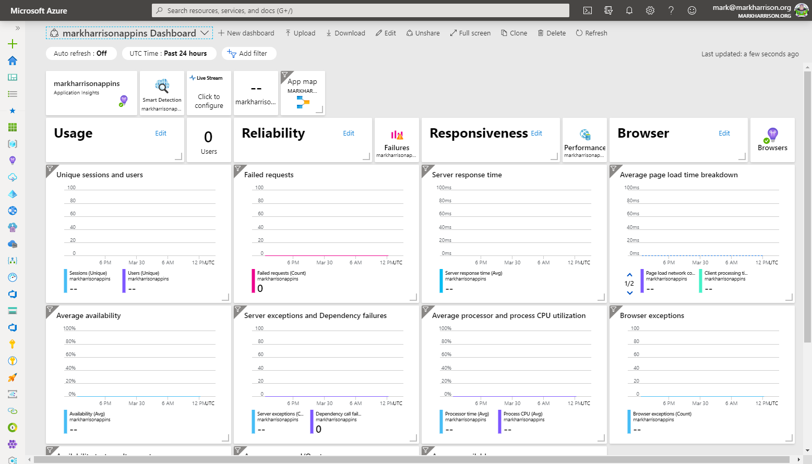

Of course we wont any activity yet - we first have to develop and deploy an application.

---
[Home](appinsights-0.md) | [Next](appinsights-2.md)
