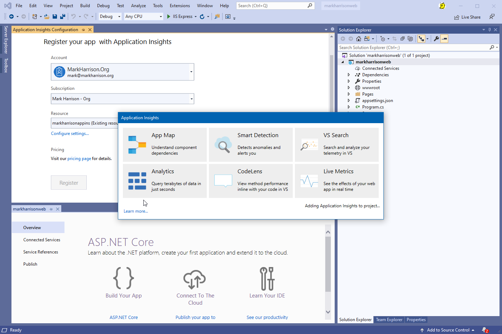
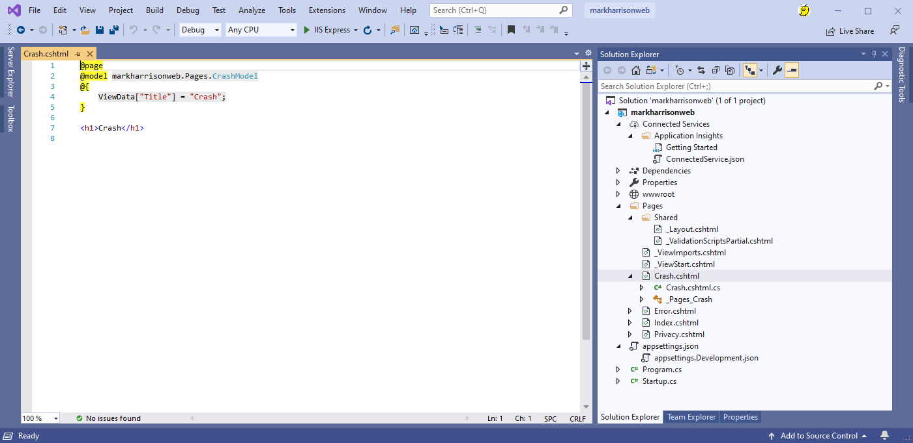
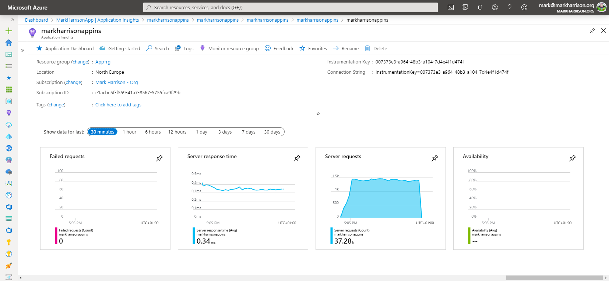

# Application Insights - Hands-on Lab Script - part 2

Mark Harrison : checked & updated 31 March 2020 - original 6 Aug 2018


- [Part 1 - Create AppInsights instance](appinsights-1.md)  
- [Part 2 - Develop and deploy AppInsights enabled webapp](appinsights-2.md) ... this document
- [Part 3 - Get insights on application](appinsights-3.md)
- [Part 4 - Advanced Analytics](appinsights-4.md)  
- [Part 5 - Availability Monitoring](appinsights-5.md)
- [Part 6 - Usage Behaviour Analysis](appinsights-6.md)
  
## Develop and Deploy AppInsights enabled webapp

### Create a .NET Core Web Application

- Use Visual Studio 2019 to create a .NET Core Web Application


### Enable AppInsights

- Right click on project and select `Add` | `Application Insights Telemetry`


- There maybe a warning to update SDK - if so then accept
- Click `Get Started`  


- Select the AppInsights instance we created earlier





This process will insert some code into the WebApp to connect the app to the AppInsights instance and send the telemetry that is generated.


Also notice that the AppInsights IntrumentationKey has been added to the appsettings.json configuration file.

In real world development, different instrumentation keys should be used for dev / staging / production etc. to keep the telemetry separate across the different stages.  This can be done by setting the key in code from an environment variable.

- Amend the Key to match that used by the App Insights instance we created in part 1


```json
{
  "ApplicationInsights": {
    "InstrumentationKey": "007373e3-a964-48b3-a104-7d4e4f1d474f"
  }
}
```

Make sure the ApplicationInsights Nuget package is greater than 2.2.0 - upgrade if neccessary


Updated


### Client Monitoring

The preceding steps are enough to start collecting server-side telemetry. Next we will enable collecting client usage telemetry - a JavaScript snippet must be added to our web pages.

In _ViewImports.cshtml, add injection:

```c#
@inject Microsoft.ApplicationInsights.AspNetCore.JavaScriptSnippet JavaScriptSnippet
```

In _Layout.cshtml, insert HtmlHelper at the end of the `<head>` section but before any other script. If you want to report any custom JavaScript telemetry from the page, inject it after this snippet:

```c#
    @Html.Raw(JavaScriptSnippet.FullScript)
    </head>
```


When we run the application, and examine the source code - we can see the client monitoring javascript


### Bad code

Add a new web page with some logic to the app to cause an exception - we will use this later.




Add the following code to send the telemetry on an exception to App Insights.  

Crash.cshtml

```c#
@page
@using Microsoft.ApplicationInsights
@model markharrisonweb.Pages.CrashModel
@{
    ViewData["Title"] = "Crash";

    string strError = "error";

    try
    {
        int x = 100;
        x = x / 0;
    }
    catch (Exception ex)
    {
        // Report the exception to Application Insights.
        Model.telemetryClient.TrackException(ex);

        strError = ex.ToString();
    }
}

<h1>Crash</h1>
@Html.Raw(strError)
```


Also add the following code to the code-behind file

Crash.cshtml.cs

```c#
using Microsoft.AspNetCore.Mvc.RazorPages;
using Microsoft.ApplicationInsights;

namespace markharrisonweb.Pages
{
    public class CrashModel : PageModel
    {
        public TelemetryClient telemetryClient;
        public CrashModel(TelemetryClient telemetry)
        {
            this.telemetryClient = telemetry;
        }

        public void OnGet()
        {

        }
    }
}
```


### Call backend service

Next, add a new web page with some logic to call some backend API or database - we will use this later.

Below is example of how this could be done.

```c#
@page
@using System.Text;
@using System.Net;
@using System.IO;
@model markharrisonweb.Pages.RSSFeedModel
@{
    ViewData["Title"] = "RSSFeed";

    string RSSFeedURL = "https://feeds.feedburner.com/azure1news";
    int bufSize = 65536;
    int length;
    byte[] buf = new byte[bufSize];
    StringBuilder sb = new StringBuilder(bufSize);

    HttpWebRequest request = (HttpWebRequest)WebRequest.Create(RSSFeedURL);
    HttpWebResponse response = (HttpWebResponse)request.GetResponse();
    Stream responseStream = response.GetResponseStream();

    // Read response stream until end
    while ((length = responseStream.Read(buf, 0, buf.Length)) != 0)
    {
        sb.Append(Encoding.UTF8.GetString(buf, 0, length));
    }
}

<h1>RSSFeed</h1>

@Html.Raw(sb.ToString())
```


### Snapshot Debugging

Optional step needed for Snapshot Debugging

Add SnapshotCollector Nuget package


Add the following code to startup.cs

```c#
using Microsoft.ApplicationInsights.SnapshotCollector;
```

AAdd the following at the end of the ConfigureServices method in the Startup class in Startup.cs.

```c#
    services.AddSnapshotCollector((configuration) =>
        Configuration.Bind(nameof(SnapshotCollectorConfiguration), configuration));

```

Add the following settings to the appsettings.json file

```json
{
  "ApplicationInsights": {
    "InstrumentationKey": "<your instrumentation key>"
  },
  "SnapshotCollectorConfiguration": {
    "IsEnabledInDeveloperMode": false,
    "ThresholdForSnapshotting": 1,
    "MaximumSnapshotsRequired": 3,
    "MaximumCollectionPlanSize": 50,
    "ReconnectInterval": "00:15:00",
    "ProblemCounterResetInterval":"1.00:00:00",
    "SnapshotsPerTenMinutesLimit": 1,
    "SnapshotsPerDayLimit": 30,
    "SnapshotInLowPriorityThread": true,
    "ProvideAnonymousTelemetry": true,
    "FailedRequestLimit": 3
  }
}

```


### Custom Events

We can instrument application code by augmenting the captured telemetry with custom events and custom metrics (continuous measurement).

This could also be used for behaviour monitoring, and identify what users do you your site.

Below is example of how this could be done.

The Web page will generate a random color and send the result to the AppInsights telemetry.

Color.cshtml

```c#
@page
@using Microsoft.ApplicationInsights
@model markharrisonweb.Pages.ColorModel
@{
    ViewData["Title"] = "Color";

    string[] strColors = { "red", "blue", "yellow", "green" };
    Random r = new Random();
    int rInt = r.Next(strColors.Length);
    string strRandColor = strColors[rInt];

    var properties = new Dictionary<string, string> { { "Color", strRandColor } };
    Model.telemetryClient.TrackEvent("ColorEvent", properties, null);
}

<h1>Color</h1>
<svg height="200" width="200">
    <circle cx="100" cy="100" r="95" stroke="black" stroke-width="3" fill="@Html.Raw(strRandColor)" />
</svg>
```


Also add the following code to the code-behind file

Color.cshtml.cs

```c#
using Microsoft.AspNetCore.Mvc.RazorPages;
using Microsoft.ApplicationInsights;

namespace markharrisonweb.Pages
{
    public class ColorModel : PageModel
    {
        public TelemetryClient telemetryClient;
        public ColorModel(TelemetryClient telemetry)
        {
            this.telemetryClient = telemetry;
        }

        public void OnGet()
        {

        }
    }
}
```


### Deploy Application

Our application is now complete - lets deploy it.

- Publish application to Azure
  - Select the WebApp resource created earlier

  

  

  

  

  

  

- Once published, we can access our web application

  

  

### Test web site  

Put the website under a load.  The following PowerShell may be useful, amend to the WebApp Url

```PowerShell
for ($i = 0 ; $i -lt 100; $i++)
{
 Invoke-WebRequest -uri https://markharrisonapp.azurewebsites.net/
}
```

### AppInsights Overview

Check the AppInsights overview page.

Note the response times, server requests, failed requests.



---
[Home](appinsights-0.md) | [Prev](appinsights-1.md) | [Next](appinsights-3.md)
