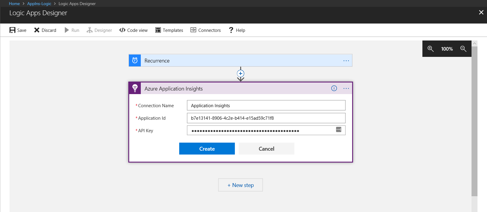
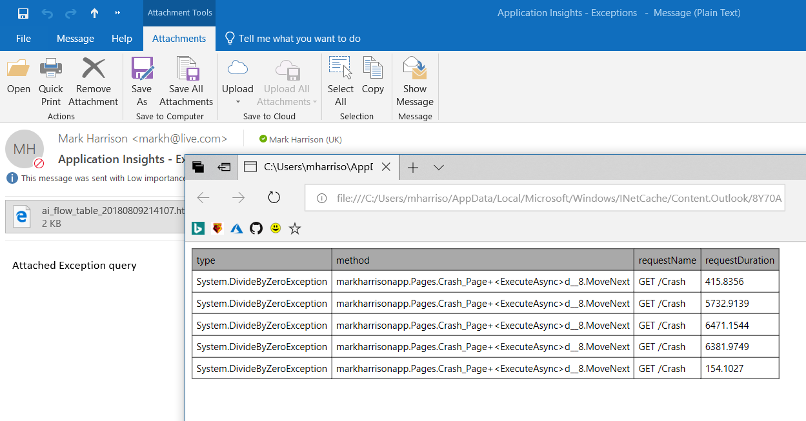

# Application Insights - Hands-on Lab Script - part 4

Mark Harrison : 6 Aug 2018


- [Part 1 - Create AppInsights instance](appinsights-1.md)  
- [Part 2 - Develop and deploy AppInsights enabled webapp](appinsights-2.md)
- [Part 3 - Get insights on application](appinsights-3.md)
- [Part 4 - Advanced Analytics](appinsights-4.md)   ... this document
- [Part 5 - Availability Monitoring](appinsights-5.md)  
- [Part 6 - Usage Behaviour Analysis](appinsights-6.md)

## Advanced Analytics

### Overview

Analytics is the powerful search and query tool of Application Insights.  It is a webtool accessed from the AppInsights overview blade.


### Query data in Analytics

A typical query starts with a table name followed by a series of operators separated by |.

Some common queries and help are available on the Home page

### Users  

Example: Top 10 countries by traffic in the past 24 hours

```text
requests
 | where  timestamp > ago(24h)
 | summarize count() by client_CountryOrRegion
 | top 10 by count_
 | render piechart
```


### Performance

Example: What are the 50th, 90th, and 95th percentiles of request duration in the past 24 hours?

```text
requests
 | where timestamp >= ago(24h)
 | summarize percentiles(duration, 50, 90, 95) by bin(timestamp, 1h)
 | render timechart
```


### CustomEvents

Example: The following query creates a pie chart based on our color page customevents

```text
customEvents
 | where  timestamp > ago(24h)
 | where name == "ColorEvent"
 | summarize count() by tostring( customDimensions.Color )
 | render piechart
```


### More information and tutorials about the query langauge

<https://docs.loganalytics.io/docs/Learn/Getting-Started/>

<https://docs.loganalytics.io/docs/Learn/Tutorials/>

### API access / Logic Apps

The queries can be accessed remotely by means of an API.

A key needs to be generated to access the API


An example of using the API is the Logic Apps connector for App Insights.  For example we can peridocially generate an email showing exceptions in our application.






---
[Home](appinsights-0.md) | [Next](appinsights-3.md)  | [Next](appinsights-5.md)
