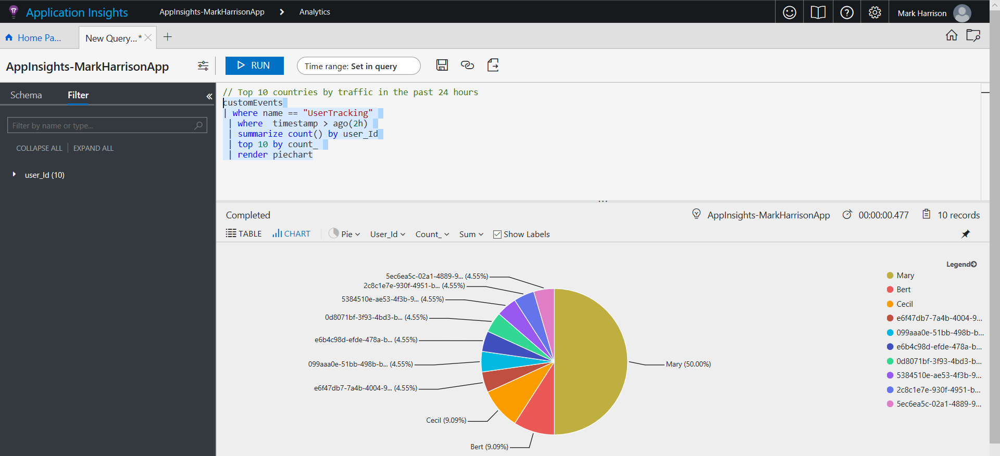

# Application Insights - Hands-on Lab Script - part 6

Mark Harrison : 6 Aug 2018


- [Part 1 - Create AppInsights instance](appinsights-1.md)  
- [Part 2 - Develop and deploy AppInsights enabled webapp](appinsights-2.md)
- [Part 3 - Get insights on application](appinsights-3.md)
- [Part 4 - Advanced Analytics](appinsights-4.md)  
- [Part 5 - Availability Monitoring](appinsights-5.md)
- [Part 6 - Usage Behaviour Analysis](appinsights-6.md) ... this document

## Usage Behaviour Analysis

### Overview

AppInsights collects usage information to help understand how users interact with an application.

In order to track what a user does over time, AppInsights needs the following for every page view:

- User Id
- Session Id

Each Id should be a Guid or unique complex string .

### To be done

To be done - need to create some code to generate user telemetry

<https://docs.microsoft.com/en-gb/azure/application-insights/app-insights-usage-send-user-context>

<https://docs.microsoft.com/en-gb/azure/application-insights/app-insights-api-custom-events-metrics#page-views>

### temp example

```c#
@page
@using Microsoft.ApplicationInsights
@{
    ViewData["Title"] = "User";
    Layout = "~/Pages/_Layout.cshtml";

    var tc = new TelemetryClient();

    tc.Context.User.Id = System.Guid.NewGuid().ToString();
//    tc.Context.User.Id = "Bill";

    tc.Context.Session.Id = System.Guid.NewGuid().ToString();

    tc.TrackEvent("UserTracking");
}

<h2>User</h2>
User Id: @Html.Raw(tc.Context.User.Id)
<br />
Session Id: @Html.Raw(tc.Context.Session.Id)
```



---
[Home](appinsights-0.md) | [Prev](appinsights-6.md)